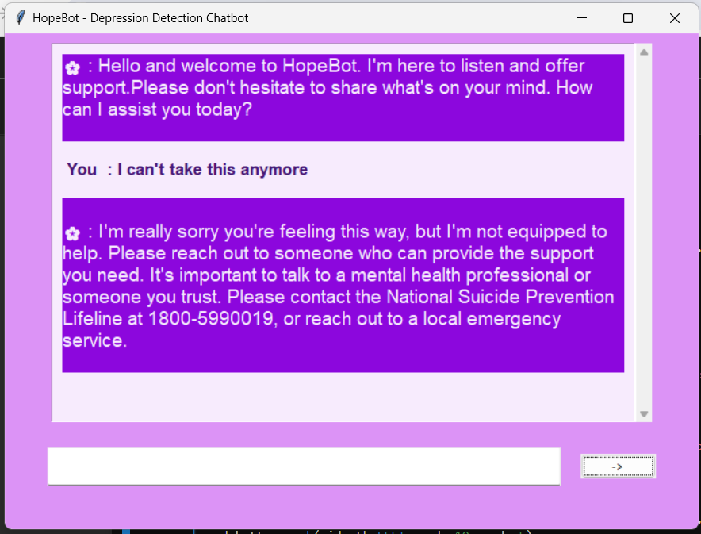

This README provides a clear overview of your project, instructions for setup, usage, and a screenshot to give users a visual representation of the chatbot.
# HopeBot - Depression Detection Chatbot

## Overview

HopeBot is a chatbot designed to detect potential suicidal messages and provide supportive responses or helplines. It aims to offer immediate assistance and guidance for individuals in need of help. This project includes a Jupyter Notebook that demonstrates the chatbot's functionality and how it interacts with users.

## Features

- **Detection of Suicidal Messages:** The chatbot analyzes user messages and detects potential suicidal content.
- **Supportive Responses:** It provides appropriate responses and helplines for users who might be in distress.
- **Interactive Interface:** The chatbot features a user-friendly interface with a modern look.
## Image

# Thank-You for exploring the project. I hope this chatbot will provide valuable support to those in need. We will definately try to bring more features in it :D
